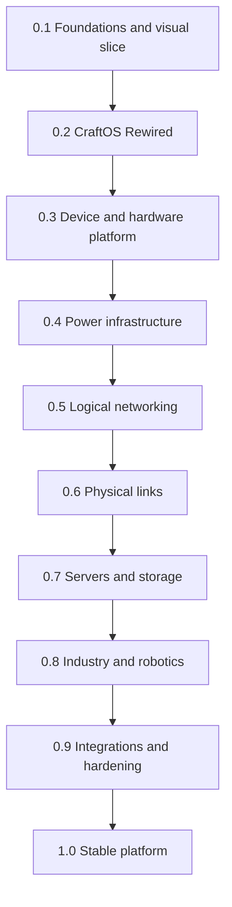

<!--
SPDX-FileCopyrightText: 2026 Vynzaro

SPDX-License-Identifier: MPL-2.0
-->

# CC: Rewired roadmap

This roadmap defines the intended order of development for CC: Rewired (CC:RW). It is a planning document, not a claim
that listed features already exist and not a promise of release dates. Released behaviour is documented in the root
[`CHANGELOG.md`](../CHANGELOG.md).

## Product direction

CC: Rewired is a compatibility-conscious fork of CC: Tweaked for modern Minecraft. It keeps ComputerCraft's approachable
Lua-programmable computers while incrementally adding a modern interface, recognisable 2020s technology, deeper
infrastructure gameplay and optional interoperability with other computer and engineering mods.

The first supported line targets Minecraft 1.20.1 and Forge 47. The inherited Fabric modules remain build-tested, but
new features are not required to ship simultaneously on Fabric during the first release lines.

## Sources and boundaries

| Source | What CC: Rewired preserves or learns from it | Boundary |
| --- | --- | --- |
| [ComputerCraft] | Immediate setup, Lua programming, turtles, redstone and understandable peripherals | A standard computer must remain usable without assembling individual components |
| [CC: Tweaked] | Current implementation baseline, Lua and Java APIs, world compatibility, addon ecosystem, tests and tooling | Compatibility identifiers are not renamed without a tested migration path |
| [OpenComputers] | Modular hardware, addressed components, mountable storage, resource limits, power, racks, remote terminals, microcontrollers and drones | Concepts are redesigned for CC:RW; OpenComputers is not a runtime dependency |
| [OpenComputers II] / [OC2R] | Device interoperability and coexistence with virtualised RISC-V/Linux computers | Linux and CPU emulation remain outside the CC:RW core |
| Modern technology | USB-C, Bluetooth, Ethernet, Wi-Fi, optical fibre, routers, switches, servers, storage and accessible graphical setup | Realism must produce understandable gameplay choices rather than administrative busywork |
| Create, Power Grid and other mods | Mechanical, electrical, industrial and economic integration points | Integrations remain optional and cannot replace the standalone CC:RW core |

When code or assets are reused, their licences and copyright notices must be reviewed and preserved. Inspiration must
not be presented as authorship, endorsement or completed compatibility.

## Non-negotiable design rules

1. **Compatibility first.** Initially retain the `computercraft` mod ID, resource namespace, `dan200.computercraft`
   packages, Lua APIs and world identifiers.
2. **Simple by default, deep by choice.** Standard computers remain ready to use. Modular hardware belongs primarily to
   advanced computers, workstations, servers, embedded controllers and robots.
3. **Terminal always available.** CraftOS Rewired adds a graphical layer without removing the terminal. The inherited
   CraftOS environment remains available as a recovery path while the new system matures.
4. **Separate hardware from software.** Java implements Minecraft-facing hardware and safety boundaries. Lua implements
   the operating environment, network services and user-facing programs where practical.
5. **Physical and logical networks are distinct.** Cable graphs carry frames; routing, transport and services are
   implemented above them. Rednet is a compatibility, learning and emergency layer, not the new network foundation.
6. **Power and networking create choices.** Consumption, latency, range, bandwidth and congestion must be observable,
   configurable and balanced. Exact values are not frozen until prototypes are measured.
7. **Optional integrations stay optional.** CC:RW must work without Create, Power Grid, Patchouli, OC2R or economy mods.
8. **Server safety is a feature.** Memory, disk, execution time, packet traffic and world interaction require limits and
   permission checks.
9. **No feature by documentation alone.** Planned functionality is not advertised as available until it has tests and a
   distributable build.

## Version policy

- Versions follow semantic versioning while the public API is being established.
- `0.x` release lines may contain breaking changes, but every intentional incompatibility must be documented.
- Alpha builds are incomplete development previews. Beta begins only after the corresponding feature set is complete.
- No calendar dates are assigned until contributor capacity and technical estimates are credible.
- A milestone may be split into additional minor versions instead of merging unfinished systems.

## Development sequence

## 0.1.x — Foundations and working visual slice

**Status:** active.

### Purpose

Establish an honest, buildable fork and prove the new identity with one complete, playable visual slice before adding
new infrastructure systems.

### Scope

- Independent CC: Rewired identity, distribution metadata, attribution and reproducible builds.
- Forge 1.20.1 as the primary supported development target.
- Human-authored block/item textures and models for standard and advanced computers.
- Shared physical design: standard hardware uses light iron-toned materials and a green status light; advanced hardware
  uses graphite/deepslate materials, real gold accents and an amber status light.
- First modern computer interface frame, retaining terminal access and existing behaviour.
- Accessibility review for contrast, text scale and colour-independent state indicators.
- Contributor tasks for textures, models, UI, translation, testing and documentation.

### Explicit exclusions

- No new cable network.
- No electrical consumption.
- No Create or Power Grid dependency.
- No drones.
- No complete CraftOS ROM replacement.

### Exit gate

- Standard and advanced computers are visually distinct in world, inventory and interface.
- Existing computers, turtles, peripherals, worlds and Lua programs remain functional.
- Forge build, tests, licensing checks and distributable JAR generation pass.
- Images and assets have verifiable human provenance and correct SPDX metadata.

## 0.2.x — CraftOS Rewired preview

**Status:** planned.

### Purpose

Create a modern but lightweight user experience without turning CC:RW into desktop-environment simulation for its own
sake.

### Scope

- Optional graphical shell designed for ComputerCraft-sized displays.
- First-run setup, language, theme, accessibility and network-ready device naming.
- Launcher, settings, file management, peripheral manager and integrated help.
- In-game manual, with optional Patchouli presentation when installed.
- Desktop, Server, Router, CPE, NOC, PLC, HMI, Robot and Recovery profiles built from shared components rather than
  separate incompatible operating systems.
- Early implementation through normal Lua modules and `startup.lua`; invasive ROM replacement is deferred until the
  design is proven.
- Compatibility path for existing shell commands and Lua programs.

### Exit gate

- A new user can place a computer, complete setup, open help and run a Lua program without external documentation.
- The graphical shell can be disabled and recovered from the terminal.
- UI components have automated Lua tests where practical.

## 0.3.x — Rewired device and hardware platform

**Status:** planned.

### Purpose

Provide the common abstraction required by modern ports, modular machines, power accounting, networks and cross-mod
devices.

### Scope

- Rewired Device Bus with stable device identities, capability discovery and attach/detach events.
- Compatibility adapter exposing existing CC peripherals through the new bus without breaking `peripheral.*`.
- Local direct connections, initially represented by USB/USB-C-style ports and cables.
- Hot-plug rules, ownership, permissions and clear user feedback.
- Optional CPU, RAM, storage, graphics and expansion-card capabilities for advanced hardware.
- Configurable memory, disk, operation and component limits.
- Standard computers remain integrated appliances; installing parts is not required for basic play.
- Public registration API for addon developers, documented before being treated as stable.

### OpenComputers influence

This milestone deliberately adopts the useful ideas of addressed components, modular cases and limited resources. It
does not copy OpenComputers' component API or require its exact tier progression.

### Exit gate

- Existing and new devices can coexist on one computer.
- Hot-plug behaviour is deterministic across save/reload.
- Limits prevent obvious server resource exhaustion without making introductory programs impractical.

## 0.4.x — Power infrastructure

**Status:** planned; numeric balance remains research.

### Purpose

Make computers part of modded electrical infrastructure while preserving a configurable low-friction mode.

### Scope

- Internal energy contract separating device demand from external power providers.
- Nominal, idle, active and peak consumption for computers, monitors, printers, network equipment, storage and robotics.
- Power connectors, distribution blocks and observable consumption.
- Graceful shutdown, brownout behaviour, batteries and later UPS support.
- Forge Energy adapter where appropriate.
- Optional integration with Power Grid and Create-related electrical systems through dedicated adapters.
- Server configuration to scale or disable power requirements.

### Exit gate

- Power loss and restoration never silently corrupt computer data.
- Consumption is measurable and documented rather than arbitrary.
- CC:RW remains playable without any external energy mod.

## 0.5.x — Rewired logical networking

**Status:** planned.

### Purpose

Replace the open broadcast-modem experience with an explicit, inspectable and programmable network stack while keeping
legacy programs usable.

### Scope

- Versioned frames over low-level modem transmission.
- Network addresses, routing, hop limits/TTL and diagnostic messages.
- Unreliable datagrams plus a reliable ordered transport and socket abstraction.
- DHCP-like configuration, DNS-like naming, NTP-like time, service discovery and authentication.
- Routers and access points with named networks, credentials, access control and administrative ownership.
- Network segmentation, firewall rules and auditable connection state.
- Compatibility bridge for Rednet; Rednet does not become the internal implementation.
- Reference services for messaging, web/API access and remote administration.

### Exit gate

- Two routed subnets can discover services and communicate through documented APIs.
- Authentication does not transmit reusable plaintext credentials as its normal protocol.
- Packet loops, malformed frames and floods are bounded by tests and configuration.

## 0.6.x — Physical links and network equipment

**Status:** planned.

### Purpose

Make connection medium matter physically and mechanically.

### Scope

- USB/USB-C for inexpensive direct peripheral connections.
- Bluetooth-style pairing for short-range, low-throughput personal devices.
- Wi-Fi for convenient shared wireless access with range and interference limits.
- Copper Ethernet for dependable local networks.
- Optical fibre for highest throughput and distance, balanced by higher material and equipment cost.
- Switches, routers, access points, transceivers and media converters.
- Observable latency, bandwidth, distance, queueing and congestion.
- A CC:RW-owned cable graph and data protocol; external power cables are not silently repurposed as data networks.
- Minecraft-shaped ports, connectors and models rather than photorealistic miniatures.

### Exit gate

- Medium choice changes measured network behaviour.
- Cable placement, removal, chunk loading and topology changes remain deterministic.
- Network equipment exposes useful diagnostics in both UI and Lua.

## 0.7.x — Servers, storage and data centres

**Status:** planned.

### Purpose

Support persistent shared services and meaningful infrastructure builds.

### Scope

- Headless server units, server racks and remote management terminals.
- Rack networking and power distribution without hiding their separate logical models.
- Mountable removable drives, SSD-like storage, shared storage and NAS services.
- RAID-inspired redundancy only after failure and recovery semantics are specified.
- Backup, restore, logs, monitoring and service health APIs.
- Reference NOC and data-centre patterns for DNS, authentication, messaging, web/API, databases and storage.
- Optional economy hooks for charging for connectivity or hosted services; no required economy mod.

### Exit gate

- A server can be installed, administered remotely, backed up and recovered using documented gameplay.
- Storage sharing has explicit permissions and cannot corrupt data through simultaneous unsafe writers.

## 0.8.x — Industry, embedded systems and robotics

**Status:** planned.

### Purpose

Extend CC:RW from desktop computing into reliable automation without making central servers directly responsible for
every machine tick.

### Scope

- Microcontrollers and PLC-like embedded computers.
- HMI, telemetry, alarms and SCADA supervision.
- MES/WMS reference services for production and storage coordination.
- Local fail-safe control: PLCs continue safe operation when SCADA or the network is unavailable.
- Modernised turtles and configurable robot platforms.
- Drones for inspection, logistics and limited world interaction with permission controls.
- IoT-style sensors and actuators using the same device and network contracts.
- Integration adapters for Create and compatible industrial mods, including Pressurized when a stable API and matching
  Minecraft version are available.

### Exit gate

- An automated cell continues safely through network loss and computer restart.
- Robotics has explicit ownership, chunk and world-interaction limits.
- Reference PLC/HMI and drone examples are documented and tested.

## 0.9.x — Ecosystem integration and hardening

**Status:** planned.

### Purpose

Turn the separate systems into a coherent platform and prove compatibility before 1.0.

### Scope

- Compatibility matrix for major CC: Tweaked addons and existing Lua software.
- Optional `cc-rewired-compat-oc2r` module for OpenComputers II: Reimagined on compatible loaders and Minecraft versions.
- Carefully scoped adapters between CC:RW peripherals and OC2R high-level devices.
- Explicit network gateways instead of pretending the two mods use identical packet semantics.
- Create, Power Grid, Patchouli and economy integration testing.
- Migration tools, performance profiling, permission review and denial-of-service resistance.
- API documentation, in-game guides, translations and modpack-author configuration.
- Deprecation notices and final compatibility decisions for 1.0.

### OpenComputers compatibility boundary

- OpenComputers 1 remains an architectural reference, not a dependency.
- OC2R interoperability is optional and isolated from the CC:RW core.
- Shared virtual disks are deferred until locking and corruption prevention are demonstrably safe.
- RISC-V, Z80, Linux and CP/M execution remain OC2R responsibilities.

### Exit gate

- Supported integrations can be removed without preventing CC:RW from starting.
- Public APIs have tests and migration notes.
- No known critical data-loss, privilege or server-stability issue remains open.

## 1.0.0 — Stable Rewired platform

**Status:** planned.

Version 1.0 requires a coherent modern visual identity, a stable CraftOS Rewired experience, documented device/power/
network contracts, reliable migration from the supported CC: Tweaked baseline and production-quality Forge 1.20.1
builds. Features which are not mature enough are postponed rather than weakening the release gate.

## Research tracks outside the 1.0 critical path

These ideas may be prototyped independently but must not delay the core roadmap:

- Additional language runtimes such as Python-like or compiled-language environments.
- Full VM suspension with live process-stack persistence across chunk unloads.
- RISC-V or other CPU emulation inside CC:RW.
- Cross-dimensional or quantum-style links.
- Advanced graphics acceleration beyond the terminal-oriented display model.
- Later Minecraft and loader ports after the Forge 1.20.1 line is stable.

## Issue and project-board structure

Roadmap work should be split into small issues with one primary label:

- `foundation`
- `visual`
- `craftos`
- `device-bus`
- `power`
- `networking`
- `servers-storage`
- `industry-robotics`
- `integration`
- `compatibility`
- `documentation`

OpenComputers-related work additionally uses one of:

- `OC-inspired`: concept reimplemented for CC:RW.
- `OC2R-compat`: actual optional interoperability.
- `research`: no implementation commitment yet.

Each implementation issue must define user-visible behaviour, compatibility impact, tests, documentation and an exit
condition. Large ideas without those fields remain discussions rather than scheduled work.

## Current reality

The current `0.1.0-alpha.1` line establishes identity, metadata, documentation and build reliability. It does not yet
implement the planned visual overhaul, CraftOS Rewired, device bus, power system, network stack, physical cables,
servers, drones or OpenComputers interoperability.

[ComputerCraft]: https://github.com/dan200/ComputerCraft
[CC: Tweaked]: https://github.com/cc-tweaked/CC-Tweaked
[OpenComputers]: https://github.com/MightyPirates/OpenComputers
[OpenComputers II]: https://github.com/fnuecke/oc2
[OC2R]: https://github.com/North-Western-Development/oc2r
